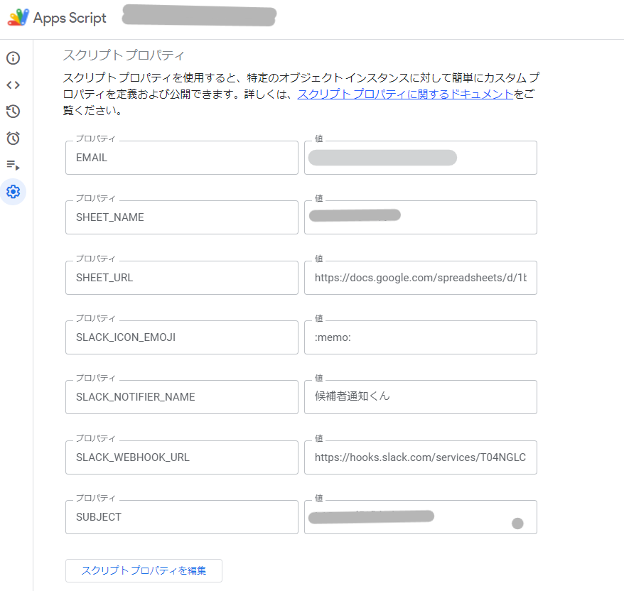
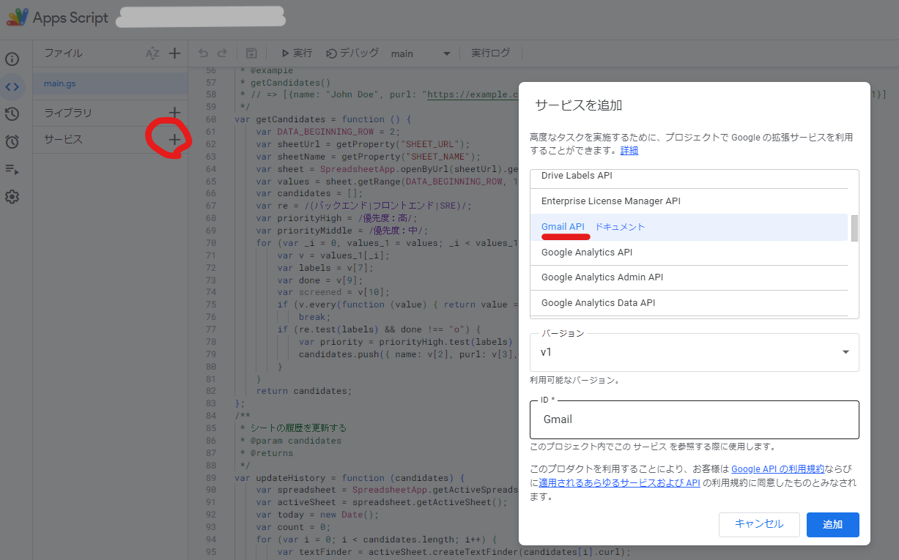
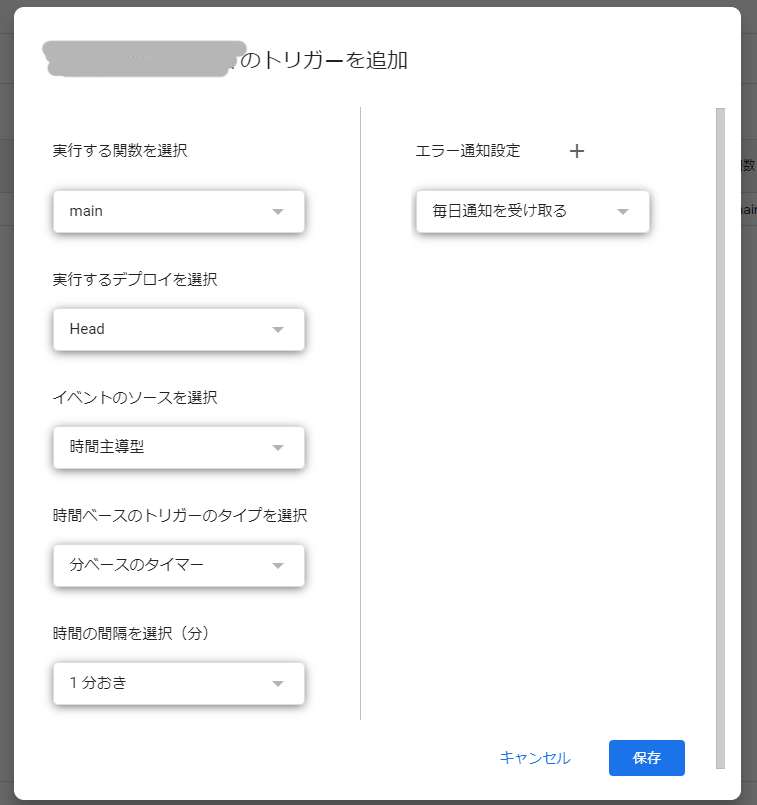

# new-candidate-notifier

新規候補者が追加されたらお知らせしてくれるプログラムです。
SlackとGmail宛に通知を送ります。
通知は件数のみです。候補者名や候補者URLなどは送りません。
新規候補者は GAS が有効化されたスプレッドシート上に記録していくため、一度通知された候補者が再度通知されることはありません。

# How to use

### スプレッドシート上で Google Apps Script を有効にし、スクリプトプロパティを設定する。

| Key                 | Value                                                           |
| ------------------- | --------------------------------------------------------------- |
| SHEET_NAME          | 候補者を抽出するシートの名前                                    |
| SHEET_URL           | 候補者を抽出するシートのURL                                     |
| SLACK_ICON_EMOJI    | Slack通知する際のスタンプ名(e.g., :memo:)                       |
| SLACK_NOTIFIER_NAME | Slack通知する際の名前（e.g., 通知くん）                         |
| SLACK_WEBHOOK_URL   | Slack Webhook URL（e.g., https://hooks.slack.com/services/...） |
| SUBJECT             | 送信するメールのタイトル                                        |



### Gmail サービスを有効化する

Gmail APIを利用するため、GAS 画面上で Gmail サービスを追加する。



### clasp を使って GAS にコードを push する

```bash
$ clasp login
Logging in globally…
🔑 Authorize clasp by visiting this url:
https://accounts.google.com/o/oauth2/v2/auth?access_type=offline&scope=https...
...
Authorization successful.

Default credentials saved to: /path/to/current/directory/.clasprc.json.

$ clasp push
└─ /path/to/current/directory/appsscript.json
└─ /path/to/current/directory/main.ts
Pushed 2 files.
```

### GAS のトリガーを有効にする

最も短い1分間隔のトリガーであっても、スプレッドシート・GASどちらの制限も意識する必要がないため、最短である1分に設定しておく。


